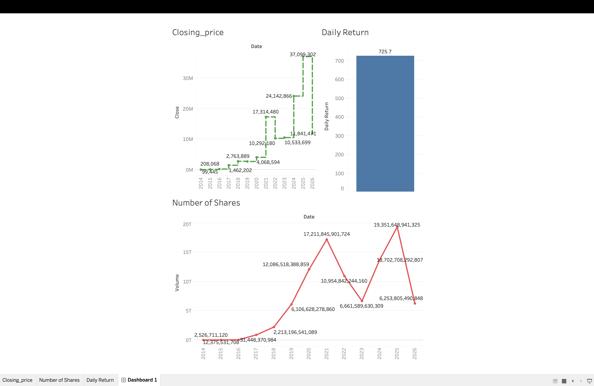

# Apple Stock Analytics Project

## Tools Used

- Python
- Pandas
- MySQL
- Tableau

## KPIs

- Daily Return
- Moving Average
- Volume Analysis

## Architecture

Apple CSV
↓
Python
↓
MySQL
↓
Tableau

## Dashboard

